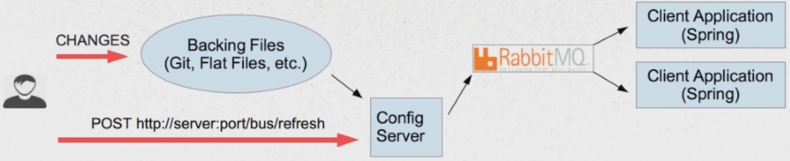
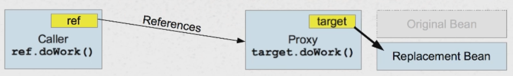

# Spring Cloud Bus - Applying dynamic changes to running services

## The Problem: Dynamic Configuration Update

### Recall Spring Cloud Config

* Centralized server that serves-up configuration information - configuration itself can be backed by source control
* Clients connect over HTTP and retrieve their configuration settings - clients connect at startup time

### Dynamic Configuration Changes (after the client is running)

* Traditional approach: **"Bounce"** all applications (repeating the startup process)
* Potential solution: **Pooling**
    * Applications could periodically poll the Config Server for changes
    * Probably best to push changes from server to the client instead
    * Config changes should be rare, so there is no need to waste resources

**Pushing** configuration changes to client application via **messaging technology** (like AMQP)


## Spring Cloud Bus

* Broadcasts configuration changes to clients - eliminates the need of pooling
* Based on **Messaging technology** - clients become subscribers to configuration changes

### How to set up Spring Cloud Bus ?

1. Add the **spring-cloud-config-server**:

```
<dependency>
    <groupId>org.springframework.cloud</groupId>
    <artifactId>spring-cloud-config-server</artifactId>
</dependency>
```

2. Add the **spring-cloud-starter-bus-amqp**:

```
<dependency>
    <groupId>org.springframework.cloud</groupId>
    <artifactId>spring-cloud-starter-bus-amqp</artifactId>
</dependency>
```

3. Add the same **spring-cloud-starter-bus-amqp** dependency to each of clients:
    * Code works automatically
    * Assumption: client code has Spring Cloud Parent/Dependency Management section

4. Run an AMQP server, such as Rabbit MQ
    * Open Source
    * Easy to install
    * Pretty popular
    * Spring Cloud Bus works automatically with Rabbit MQ on localhost

### Broadcasting Changes

1. Make changes to the config file(s) - config server does not pool for changes
2. POST **/bus/refresh** to the config server
3. Broker ensures message delivery to clients
4. Clients receive message and refresh themselves



### How refresh works?

1. Spring Boot applications can be Refreshed at Runtime
2. Actuator provides **/refresh** endpoint (POST)
3. This endpoint only affects the following:
    * Beans marked with **@ConfigurationProperties**
    * Beans marked with **@RefreshScope**
    * Logging level

### @ConfigurationProperties

* Easy alternative to multiple **@Value**
* Properties rebound on POST /refresh
* Relaxed bindings - for particular property, there can be used multiple application property names:
    * lucky-word
    * luckyWord
    * LUCKY_WORD

1. Add **@ConfigurationProperties** to the component:

```
@RestController
@ConfigurationProperties(prefix = "wordConfig")
public class LuckyWordController { ... }
```

2. Create fields that represent configuration properties + setters for them:

```
String luckyWord;
String preamble;
```

3. Create properties in the application configuration:

```
wordConfig:
  luckyWord: John
  preamble: Mr
```

### @RefreshScope

* Introduced in Spring Cloud
* Greater control, safe reloading of bean (not just property binding):
    * **Side-effect:** makes bean lazy
    * Any issues will not be discovered until the bean is actually used
* Reloaded (not just rebound) on POST /refresh
* Not Getter and Setters are required
* No Relaxed property binding

1. Mark the component with the **@RefreshScope** annotation

```
@RestController
@RefreshScope
public class LuckyWordRefreshScopeController { ... }
```

2. Create properties with **@Value** annotations:

```
@Value("${wordConfig.lucky-word}")
private String luckyWord;

@Value("${wordConfig.preamble}")
private String preamble;
```

### How **@RefreshScope** works? - Proxy Pattern

* Spring creates a proxy for the actual bean
* Proxy is dependency injected into other beans
* Proxy contains logic to call methods on the target bean
* On refresh, the target bean is changed to the newly created bean (older bean is dereferenced)
* Result: users of original bean can safely finish their work


