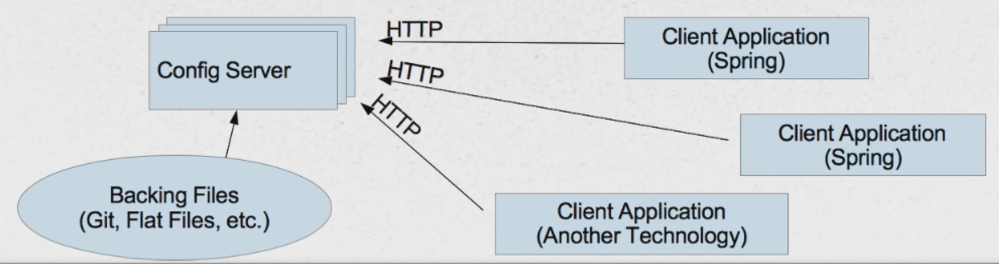

# Spring Cloud Config - Distributed/Versioned/Centralized Configuration Management

## Application Configuration

- Application are more than just code (connections to resources, other applications)
- Usually external configuration adjusts software behavior:
    - Where resources are located
    - How to connect to the DB, etc.

## Configuration Options

- Package configuration files with application - requires rebuild, restart
- Configuration files in common file system - unavailable in cloud
- Use environment variables:
    - Done differently on different platforms
    - Large # of individual variables to manage/duplicate
- Use a cloud-vendor specific solution - coupling application to specific environment

## Other configuration challenges

- **Microservices** - large number of dependent services (manual work, brittle)
- **Dynamic updates** - changes to services or environment variables require restage or restart (deployment activities)
- **Version control** - traceability

## Desired solution for Configuration

- **Language/Platform/Cloud-Independent**
- **Centralized** - one or a few discreet sources of our choosing
- **Dynamic** - ability to update settings while an application is running
- **Controllable** - same SCM choices we use with software
- **Passive** - services (applications) should do most of the work themselves by self-registering

## Spring Solution:

- **Spring Cloud Config** - provides centralized, externalized, secured easy-to-reach source of application configuration
- **Spring Cloud Bus** - provides simple way of notifying client to config changes
- **Spring Cloud Netflix Eureka** - service discovery, allows applications to register themselves as clients

## Spring Cloud Config

- Designates a **centralized server** to serve-up configuration information - configuration itself can be backed by source control
- **Clients** connect over HTTP and retrieve their configuration settings - in addition to their own, internal sources of configuration



## Spring Cloud Config Server

Available at GitHub, but it is easy to create on your own

### How to create Spring Cloud config Server?

1. Set parent project or dependency management to spring-cloud:

```xml
<dependencyManagement>
    <dependencies>
        <dependency>
            <groupId>org.springframework.cloud</groupId>
            <artifactId>spring-cloud-starter-parent</artifactId>
            <version>${spring.cloud.version}</version>
            <type>pom</type>
            <scope>import</scope>
        </dependency>
    </dependencies>
</dependencyManagement>
```

2. Add **spring-cloud-config-server** as a dependency:

```xml
<dependency>
    <groupId>org.springframework.cloud</groupId>
    <artifactId>spring-cloud-config-server</artifactId>
</dependency>
```

3. Add entry to **application.yml** that indicates location of configuration repository:

```yml
spring:
  cloud:
    config:
      server:
        git:
          uri: https://github.com/kennyk65/Microservices-With-Spring-Student-Files
          searchPaths: ConfigData
```

4. Add **@EnableConfigServer** annotation to application main file

```java
@SpringBootApplication
@EnableConfigServer
public class CloudConfigServer {

    public static void main(String[] args) {
        SpringApplication.run(CloudConfigServer.class, args);
    }

}
```

### Environment Repository

**Choices**
* Spring Cloud Config Server uses an **EnvironmentRepository** (two implementations available: Git and Native - local files)
* To use other sources you can implement **EnvironmentRepository** interface

**Organization**
1. Configuration file naming convention: **<spring.application.name>-\<profile>.yml**
    * **spring-application-name** - set by client application's **bootstrap.yml**
    * Profile - Client's **spring.profile.active**
2. Obtain settings from server - **Client** part:
    * http://\<server>:\<port>/<spring.application.name>/\<profile>
    * Spring clients do this automatically on startup

**What configuration files will loaded?**

Assumptions:
* spring.application.name = lucky-word
* spring.profiles.active = northamerica

Configuration files in the directory:
* lucky-word.yml (included, second precedent)
* lucky-word-default.yml (not included because profile has been set, if no profile is defined then this one will be included - default profile is named default)
* lucky-word-northamerica.yml (included, first precedent)
* lucky-word-europe.yml (not included, profile name does not match)
* lucky-word.properties (included, third precedent - first yml files are loaded)
* another-app.yml (not included, different app)

### Spring Cloud Configuration

Configuration can be handled by both YAML and Propeties files, but Spring Cloud Server will favor YAML.

YAML files has one great advanced over Property files - can hold multiple profiles in a single file

```yml
---
spring:
    profiles: east
lucky-word: Clover

---
spring:
    profiles: west
lucky-word: Rabbit's Foot
```

### How properties work in Spring Applications?

1. Spring have **Environment** object
2. **Environment** object contains multiple **PropertySources** - typically populated from environment variables, system properties, JNDI, developer-specified property files
3. Spring Cloud Config Client library simply adds another **PropertySource** by connecting to server over HTTP
4. Result: Properties described by server become part of client application's environment

### How properties work for non-java applications?

1. Spring Cloud exposes properties over simple HTTP interface: ** http://\<server>:\<port>/<spring.application.name>/\<profile>**
2. Reasonable easy to call server from any application - just not as automated as Spring

### What if the configuration server is down?

1. Spring Cloud Server should typically run on several instances - so downtime should be a non-issue
2. Client application can control policy of how to handle missing config server:
    * **spring.cloud.config.failFast=true**
    * Default is false
3. Config Server settings override local settings (strategy: provide local fallback settings)

## Spring Cloud Config Client

### How to create Spring Cloud config Client?

1. Set parent project or dependency management to spring-cloud:

```xml
<dependencyManagement>
    <dependencies>
        <dependency>
            <groupId>org.springframework.cloud</groupId>
            <artifactId>spring-cloud-starter-parent</artifactId>
            <version>${spring.cloud.version}</version>
            <type>pom</type>
            <scope>import</scope>
        </dependency>
    </dependencies>
</dependencyManagement>
```

2. Add **spring-cloud-config-server** as a dependency:

```xml
<dependency>
    <groupId>org.springframework.cloud</groupId>
    <artifactId>spring-cloud-starter-config</artifactId>
</dependency>
```

3. Configure application name and server location in **bootstrap.yml**:
    * this file is examined in the startup process
    * then app goes to cloud config server to obtain additional variables
    * those properties are used to configure separate application context defined in the application.yml

> NOTE: There are two application contexts loaded - Bootstrap and Application Contexts

```yml
spring:
  application:
    name: lucky-word
  cloud:
    config:
      uri: http://localhost:11000
```