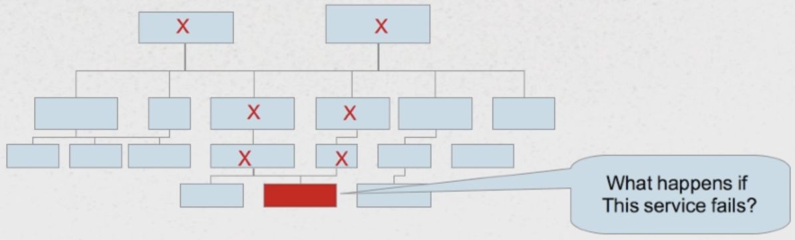

# Spring Hystrix - Circuit Breakers

## Cascade Failure

* Having a large number of services as dependencies can lead to a 'cascading failures'
* With mitigating this, microservices are a recipe for certain disaster



## The Circuit Breaker Pattern

Consideration: Household circuit breaker

* It "watches" a circuit
* When failure occurs (too much current flow), it "opens" the circuit (disconnects the circuit)
* One problem is resolved, you can manually close the breaker
* Prevents cascade failure

**The Software Circuit Breaker**

* Light, easy-to-use wrapper provided by Spring Cloud
* Detects failure conditions and "opens" to disallow further calls (Hystrix Default: 20 failures in 5 seconds)
* **Identify "fallback"** - what to do in case of a service dependence failure
    * More sophisticated catch block
    * Fallbacks can be chained
* Automatically "closes" itself after interval (Hystrix Default: 5 seconds)
* Failure definition flexible - Exception thrown or timeout exceeded over time period

## How to enable Hystrix?

1. Add dependency to Hystrix:

```
<dependency>
    <groupId>org.springframework.cloud</groupId>
    <artifactId>spring-cloud-starter-hystrix</artifactId>
</dependency>
```

2. Enable Hystrix within configuration class - **@EnableHystrix**

```
@SpringBootApplication
@EnableHystrix
public class HystrixApplication {

    public static void main(String[] args) {
        SpringApplication.run(HystrixApplication.class, args);
    }

}
```

3. Use the **@HystrixCommand** to wrap methods in a circuit breaker (based on recent failures Hystrix will call one of these two methods):

```
@Component
public class StoreIntegration {

    @HystrixCommand(
            fallbackMethod = "defaultStores"
    )
    public Object getStores(Map<String, Object> parameters) {
        // do stuff that might fail
        return null;
    }

    public Object defaultStores(Map<String, Object> parameters) {
        // do useful stuff
        return "Some Storage";
    }

}
```

## How to provide custom Hystrix properties?

1. Use **commandProperties** attribute and **@HystrixProperty** (failure/recovery behavior is highly cutomizable)

```
@HystrixCommand(
        fallbackMethod = "defaultStores",
        commandProperties = {
                @HystrixProperty(name = "circuitBreaker.errorThresholdPercentage", value = "20"),
                @HystrixProperty(name = "circuitBreaker.sleepWindowInMilliseconds", value = "1000")
        }
)
public Object getStores(Map<String, Object> parameters) {
    // do stuff that might fail
    return null;
}
```

* **circuitBreaker.errorThresholdPercentage** - over 20% failure rate in 10 second period, open breaker
* **circuitBreaker.sleepWindowInMilliseconds** - after 1 second, try closing breaker

## How the commands are called?

* **Synchronously** - call execute and block thread (default behavior)
* **Asynchronously** - call in a separate thread (queue), returning a future, deal with Future when you want (just like Spring's @Async annotation)
* **Reactively** subscribe, get a listener (Observable)

## Asynchronous Command Execution

1. Method should return Future
2. Wrap result in AsyncResult<T> - **com.netflix.hystrix.contrib.javanica.command.AsyncResult**

```
@HystrixCommand(fallbackMethod = "defaultStores")
    public Future<Object> getStoresAsynchronously(Map<String, Object> parameters) {
        return new AsyncResult<Object>() {
            @Override
            public Object invoke() {
                //do stuff that might fail
                return null;
            }
        };
    }
```

## Reactive Command Execution

1. Method should return Observable
2. Wrap result in ObservableResult<T> - **com.netflix.hystrix.contrib.javanica.command.ObservableResult**
