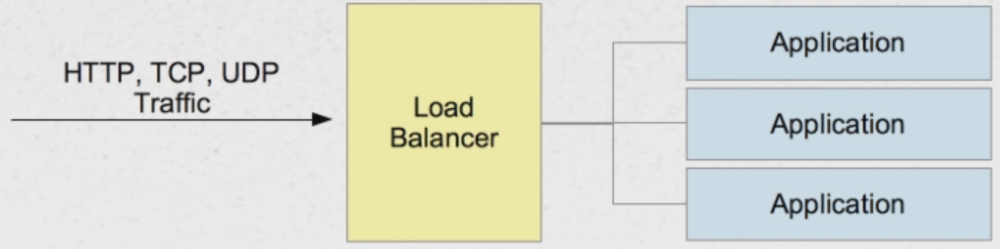
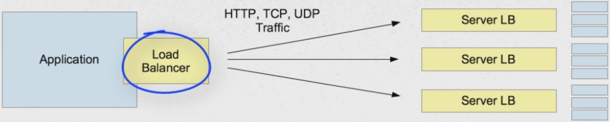

# Spring Ribbon - Load Balancing

## What is Load Balancing?

**Traditional load balancers** are server-side components:
* Distribute incoming traffic among several servers
* Software (Apache, Nginx, HA Proxy) or Hardware (F5, NSX, BigIP)



**Client-Side load balancers** selects which server to call:
* Based on some criteria
* Part of client software
* Server can still employ its own load balancer



Why do we need load balancers?
* Not all servers are the same
* **Faults** - some servers may be unavailable
* **Performance** - some servers may be slower than others
* **Regions** - some servers may be further away than others

## Spring Cloud Netflix Ribbon

### Ribbon (alone) Introduction

1. Client side load balancer
2. Automatically integrates with service discovery (Eureka)
3. Built in failure resiliency (Hystrix)
4. Caching/Batching
5. Multiple protocols (HTTP, TCP, UDP)

Spring Cloud provides an easy API Wrapper for using Ribbon.

### Ribbon Concepts (with default of Spring Cloud)

1. Determines what the list of possible servers are (for a given service (client))
    * **Static** - populated via configuration
    * **Dynamic** - populated via Service Discovery (Eureka)
2. Spring Cloud default - use Eureka when present on the classpath
    * Servers we want to call are identified by Client IDs
3. **Filtering services list**:
    * Criteria by which you wish to limit the total list
    * Spring Cloud default - Filter servers in the same Zone
4. **Ping**:
    * Used to test if the server is up or down
    * Spring Cloud default - delegate to Eureka to determine if server is up or down
5. **Load Balancer (itself)**:
    * The Load Balancer is the actual component that routes the calls to the servers in the filtered list
    * Several strategies available, but they usually defer to a Rule component to make the actual decisions
    * Spring Cloud default - **ZoneAwareLoadBalancer**
6. **Rule**:
    * The Rule is the single module of intelligence that makes the decisions on whether to call or not
    * Spring Cloud default - **ZoneAvoidanceRune**

Example below (static lists):
* stores, products - client IDs

```yml
stores:
  ribbon:
    list-of-servers: store1.com, store2.com
products:
  ribbon:
    list-of-servers: productServer1.com, productServer2.com
```

### How to use Ribbon with Spring Cloud?

1. Add the parent dependency (as usual) to Spring Cloud
2. Include Ribbon dependency (Client Side, no Server configuration required):

```xml
<dependency>
    <groupId>org.springframework.cloud</groupId>
    <artifactId>spring-cloud-starter-ribbon</artifactId>
</dependency>
```

3. Access LoadBalancer:

```
@Autowired
private LoadBalancerClient loadBalancer;

private URI getServiceURI(String serviceId) {
    ServiceInstance instance = loadBalancer.choose(serviceId);
    return URI.create(String.format("http://%s:%s", instance.getHost(), instance.getPort()));
}
```

### Customization

To customize Ribbon configuration create a Configuration class with **@RibbonClient** annotation.

Example: Replace Ping strategy when calling "subject" clients.

```
@Configuration
@RibbonClient(name = "subject", configuration = RibbonSubjectConfiguration.class)
public class RibbonConfiguration {
}
```

Important thing is that this RibbonSubjectConfiguration should not be included in the component scan.

```
@Configuration
public class RibbonSubjectConfiguration {

    @Bean
    public IPing ribbonPing(IClientConfig config) {
        return new PingUrl();
    }

}
```

