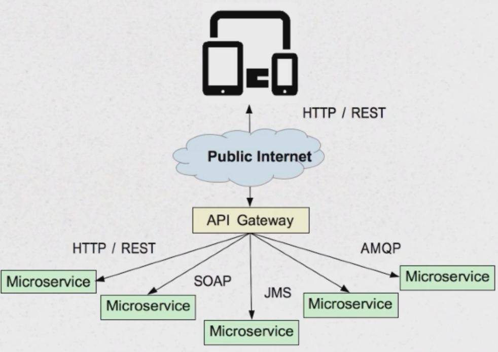

# Spring Zuul - API Gateway

## Accessing microservices via Web

1. Accessing over public internet is problematic:
    * Internal API exposed
    * Security
    * CORS Required
    * Multiple Trips
2. Different Client have different needs

## API Gateway

1. API Gateway provides simplified access for client
    * Custom API
    * Security
    * No CORS required
    * Fewer trips
2. Built for specific client needs ("facade")
3. Reduces number of remote calls + reduces data carried back to the client
4. Routes calls to specific servers
5. Handles Security/SSO
6. Handles caching
7. Protocol Translation
8. Optimized Calls/Link Expansion - HATEOAS

## Zuul

### Routing and Filtering

JVM-based router and Load Balancer
* Can be used for many API Gateway needs
* Routing - send request to real server (**Reverse Proxy**)

### Basic Usage

1. Add dependencies: **spring-cloud-starter-zuul** (includes Ribbon and Hystrix)

```
<dependency>
    <groupId>org.springframework.cloud</groupId>
    <artifactId>spring-cloud-starter-zuul</artifactId>
</dependency>
```

2. Add **@EnableZuulProxy** annotation to the configuration class:

```
@SpringBootApplication
@EnableZuulProxy
public class ZuulApplication { ... }
```

3. Default behavior - Eureka client ids become URIs
    * **/subject** routes to the **subject** service (serviceId)
    * **/verb** routes to the **verb** service (serviceId)

4. Zuul translates routes through MVC Mappings - ``ZuulController``

### Zuul Features

1. Services can be excluded: **zuul.ignored-services** (to exclude all set to *)
2. Prefix can be added: **zuul.prefix**
3. URL can be adjusted:

```yml
zuul:
  prefix: /api
  ignored-services: verb
  routes:
    subject:
      path: /sentense-subject/**
    noun:
      path: /sentense-noun/**
```

### Is Zuul an API Gateway?

* Zuul is a tool for creating an API Gateway - specifically routing
* What parts are missing?
    * Caching
    * Protocol translation
    * Resource Expansion/Link Resolution

## Caching

### Caching Possibilities

Where to use caching in our application?
* Client Cache (for example browser cache) - server sends HTTP headers to tell what client can cache and for how long:
    * Expires header
    * Etag header
* Server Cache - API Gateway
* Services cache - when they call each other

### Spring Caching abstraction

* Easy way to implement caching
* Method cache - **@Cacheable**

#### How to use Spring's Caching Abstraction

1. Annotate method with **@Cacheable**
2. Describe cache and key
3. Define a **CacheManager** - backed by SynchronizedMaps, EHCache, Gemfire

```
@Cacheable(value = "inventory", key = "#id")
@RequestMapping("/inventory/{id}")
public String getInventoryItemName(@PathVariable Long id);
```

4. Add **@EnableCacheable** to the configuration class

#### **@Cacheable** Shortcoming

1. Cache policy should ideally be directed by the "warehouse" service
2. Warehouse server should use **Expires** and **Etag** headers

### Etags - Modern, HTTP-base Caching

1. Better that Expires
2. How Etags works?
    * Client requests resource
    * Server returns resource with Etag - has value calculated from content
    * Client sends **If-none-match** header with **Etag** value whenever requesting the same resource
    * Server calculates new hash:
        * If it matches - returns 304 (Not modified)
        * If not, returns: 200 + new content + new Etag
3. Description above says about the **Shallow Etags** - saves bandwidth, not server work
4. **Deep Etags** eliminates server work and bandwidth

### How to enable Etags in Spring Application?

Create a bean in the configuration:

```
@Bean
public Filter shallowEtagHeaderFilter() {
    return new ShallowEtagHeaderFilter();
}
```

How it works?
* Calculates Hash value on ResponseBody
* Returns Etag Header with HashValue
* Stores Hash with original URL
* Examines subsequent requests for same resource (If the **If-none-match** hash value matches, return 304)

### ETag Client Side - RestTemplate

* RestTemplate does not have Caching build in
* HttpClient does - use Apache Http to enable caching in application
* Feign does not have Caching capabilities (Etags, but has interceptors)
* Consider creating Aspect for use with Feign

1. Add dependencies to the project:

```
<dependency>
    <groupId>org.apache.httpcomponents</groupId>
    <artifactId>httpclient</artifactId>
    <version>${apache.http.version}</version>
</dependency>
<dependency>
    <groupId>org.apache.httpcomponents</groupId>
    <artifactId>httpclient-cache</artifactId>
    <version>${apache.http.version}</version>
</dependency>
```

2. Provide following configuration for RestTemplate:

```
@Configuration
public class ClientCachingConfiguration {

    CacheConfig cacheConfig = CacheConfig.custom()
            .setMaxCacheEntries(1000)
            .setMaxObjectSize(8192)
            .build();

    CloseableHttpClient cachingClient = CachingHttpClients.custom()
            .setCacheConfig(cacheConfig)
            .build();

    @Bean
    @Primary
    public RestTemplate restTemplate() {
        return new RestTemplate(new HttpComponentsClientHttpRequestFactory(cachingClient));
    }

}
```

## Resource (Link) Expansion

### Resource Expansion Options: Traverson

* **Traverson** - part of Spring HATEOAS project
* Original library made for NodeJS
* "Traverses* links
* Requires two dependencies: **spring-hateoas** and **json-path**

1. Add dependencies **spring-hateoas** and **json-path**:

```
<dependency>
    <groupId>org.springframework.hateoas</groupId>
    <artifactId>spring-hateoas</artifactId>
</dependency>
<dependency>
    <groupId>com.jayway.jsonpath</groupId>
    <artifactId>json-path</artifactId>
</dependency>
```

2. Create "Resources" for domain objects - resources comprehend HAL structure/links:

```
import com.kicinger.udemy.cloud.domain.Player;
import org.springframework.hateoas.Resource;
import org.springframework.hateoas.Resources;

public class PlayerResource extends Resources<Resource<Player>> {
}
```

3. Traverson basic usage:

```
private void getPlayer() throws Exception {
    Traverson traverson = new Traverson(
            new URI("http://localhost:8080/")
            , MediaTypes.HAL_JSON
    );

    final PlayerResources playerResources = traverson
        .follow("$_links.team.href", "$_embedded.team[0]._links.players.href")
        .toObject(PlayerResources.class);

    playerResources.getContent().forEach(resource -> {
        Player player = resource.getContent();
        System.out.println(player);
    });
}
```

Notes:
* There is no Ribbon involved - to balance the request we need to manually instantiate Ribbon
* There is a possibility of providing RestTemplate that works with Ribbon and Caching and uses Traverson
* **follow(<where_to_find_link>, <where_to_put_the_result>)**

### Traverson Drawbacks

1. Traverson, not Expansion
2. Limited capacity with other formats
3. No support for XML

### Spring Data REST Projections

* Part of Spring Data REST
* Causes links to be "inlined" not links

How to use Spring Data REST Projections?

1. Add Data REST dependency:

```
<dependency>
    <groupId>org.springframework.boot</groupId>
    <artifactId>spring-boot-starter-data-rest</artifactId>
</dependency>
```

2. Define the Projection as an interface:
    * Annotate with the **@Projection**
    * Methods - describes properties of the domain object that we want to expose

```
@Projection(
        name = "inlinePlayers",
        types = { Team.class }
)
public interface InlinePlayers {

    String getName();
    String getLocation();
    String getMascotte();
    Set<Player> getPlayers();

}
```

3. Supply projection name on GET method:

```
http://localhost:8080/teams/1?projection=inlinePlayers
```

### Spring Data REST Projections Drawbacks

1. Only works when using Spring Data REST
2. Only works when projections are part of the same microservice

## Protocol Translation

Translate between front-end and back-end protocols.

How to solve the issue?
* Use API Gateway
* Use Adapters (for particular services)

No quick fixes!
* JMS - use JmsTemplate
* AMQP - Use AmqpTemplate
* SOAP - Use WebServiceTemplate



### Spring Integration - Recommended solution for Protocol Translation

* Powerful framework for enterprise integration patterns and in-memory messaging
* Adapter and Gateways for ... (a lot)

