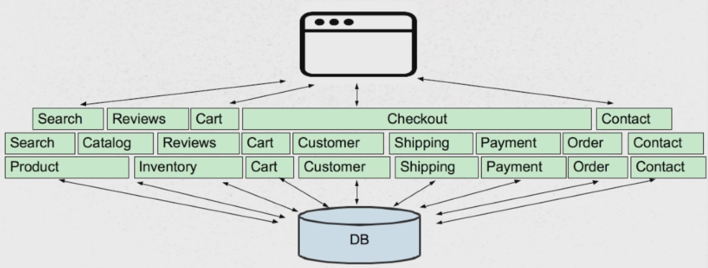
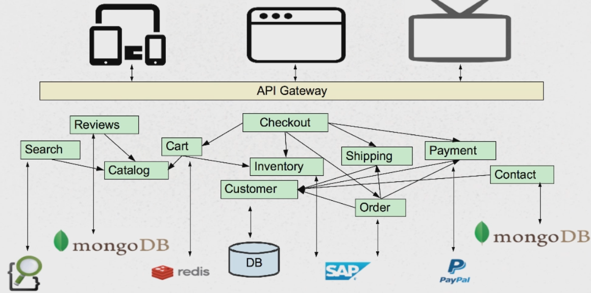

# Udemy - Microservices with Spring Cloud

## What are microservices?

Best described as:
* Architectural style (alternative to monolithic applications, fine-grained SOA)
* **Martin Fowler's definition**: Developing a single application as suite of small services, each running it its own process and communicating via leightweight mechanisms (oftne an HTTP resource API)

Microservices - Working Definition:
- Composing a single application using a suite of small services - rather than monolithic application
- Each running as independent processes - modules/components within a single executable
- Intercommunicating via open protocols (HTTP, REST, messaging)
- Separately written, deployed, scaled and maintained (potentially in different languages)
- Services encapsulate business capabilities
- Services are independently replaceable and upgradable

Microservices are **not** the same as SOA:
- SOA is about integrating various enterprise applications
- Microservices are mainly about decomposing single applications
- Microservices approach involves drawbacks and risks

Differences with SOA

| Feature | SOA | Microservices |
|----|----|----|
| What adresses? | Integration between systems | Individual applications |
| Integration through.. | Orchiestration | Choreography |
| Relies on... | Smart integration technology and dumb services | Smart services and dump integration technology |

## Monolithic vs Microservices application

### Monolithic application

Monolithic application implementation:
- Single executable application
    - Easy to comprehend, but not to digest
    - Must be written in single language
- Modularity based on Program Language:
    - Using the constructs avaialble in that language (packages, classes, functions, namespaces, etc.)
    - Various storage/service technologies used (RDBMS, Messaging, eMail, etc.)

Monolithic layer

Monolithic Challenges:
- New types of client applications
- New types of persistence/services (relational, noSQL)
- Single Codebase, Deployment, Versioning, Team Size (a lot of features in complicated systems)

Monolithic Advantages:
- Easy to comprehend (not to digest)
- Easy to test as a single unit (upt to a size limit)
- Easy to deploy as a single unit
- Easy to manage (up to a size limit)
- Easy to manage changes (up to a point)
- Easy to scale (when care is taken)
- Complexity managed by language constructs

Monolithic Drawbacks:
- Language/Framework Lock (entire app written in single technology stack)
- Digestion (single developer cannot digest a large scale codebase, single team cannot manage a single large application)
- Deployment a single unit (cannot independently deploy single change to single component)

### Microservices architecture

Componentization via Services:
- NOT language constructs
- Where services are small, independently deployable applications
- Forces the design of clear interfaces
- Changes scpoed to their affected service

Composed using suite of small services - Services are small, independently deployable applications
- Not a single codebase
- Not necessarily a single language/framework
- Modularization not based on language/framework

Communication based on lightweight protocols:
- HTTP, TCP, UDP, Messaging (Payloads: JSON, BSON, XML, Protocol Buffers, etc.)
- Forces the design of clear interfaces
- Communicate via APIs - not common database

Services encapsulate business capabilities:
- Not based on technology stach
- Vertical slices by **business function** though technology chunk also practical
- Suitable for cross-functional teams

Services easily managed - Easy to comprehend, alter, test, version, deploy, manage, overhaul, replace by small, cross-functional teams (or even individuals)

**Decentralized Governance**
- Use the right tool for the job
- Services evolve at different speeds, deployed and managed according to different needs
- Make services to be "Tolerant Readers" - relatively resilient for changes in different services
- Consumer-Driven Contract
- Antithesis of ESB - services are not Orchestrated, but **Choreographed**

**Polyglot persistence**
- Freedom to use the best technology for the job
- Don't assume single RDBMS is always the best
- Controversies:
    - Non pan-enterprise data model
    - No transactions (Eventual Consistency)

Microservices Advantages:
- Easy to digest each service (difficult to comprehend whole)
- VERY easy to test, deploy, manage, version, and scale single services
- Change cycle decoupled
- Easier to scale staff
- No language/framework etc.

Microservices Challenges:
- Complexity has been moved out of the application, but into the **operation layers** - **Fallacies of Distributed Computing**
- Services may be unavailable (never in monolith, design for failures, **circuit breakers**)
- Monitoring
- Remote calls more expensive than in-process calls
- No transactions - must rely on **eventual consistency** over ACID
- Features span multiple services
- Change management becomes a different challenge (need to consider the interaction between services, dependency management/versions)
- Refactoring module boundaries

**Fallacies of Distributed Computing**
- The network is reliable
- Latency is zero
- Bandwidth is infinite
- The network is secure
- Topology doesn't change
- There is one administrator
- Transport cost is zero
- The network is homogeneous

### How to break a Monolith into Microservices?

**Primary consideration: business functionality**
- Noun-based (catalog, cart, customer)
- Verb-based (search, checkout, shipping)
- SRP (Single Responsibility Principle)
- Bounded Context

**What does it mean Micro??**
- Size is not the compelling factor
- Small enough for an individual developer to digest
- Small enough fot be built and managed by small teams
- Documentation small enough to read and understand
- Dozens of secrets. not hundreds
- Predictable, easy to experiment with